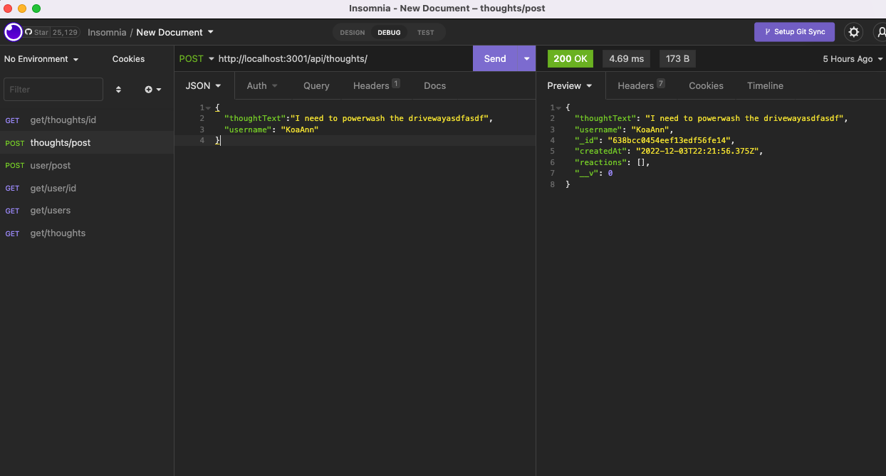

# nosqlhomework11111

## Description:

Our assignment this week was based around NOSQL. The routes, models and controllers all had to be made for their corresponding sections. Honestly it was all pretty confusing to me, I got most of it to work and I would have proceeded but I kept hitting walls and not making much progress, hopefully enough of it works and if it doesn't I will return to work on this project.

## Screenshots:

## Links:

Github repo : https://github.com/phillipanthony11/nosqlhomework11111
